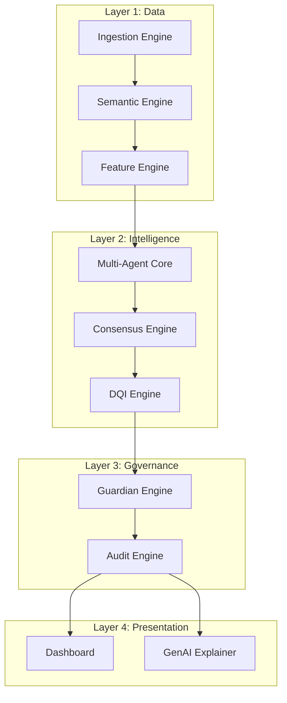

# C-TRUST Technical Whitepaper
**Clinical Trial Unified Signal & Trust (C-TRUST)**

> **Project Name**: C-TRUST
> **Problem Statement**: 1 (Novartis AI Hackathon)
> **Goal**: Unifying 23 disparate clinical trial datasets into a single Operational Intelligence Platform.

---

## 1. Executive Summary: The Core Philosophy

Clinical trial operations are currently stuck in a "Data Paradox": we have more data than ever (EDC, Labs, Safety, CTMS), but less *intelligence*. Data Managers and Medical Scouters are drowning in spreadsheets, manually reconciling "Visit Dates" and "Subject IDs", leaving them no time to actually spot the critical safety risks hiding in the noise.

**C-TRUST solves this by shifting the paradigm from "Data Monitoring" to "Operational Intelligence".**

We do not just visualize data; we *understand* it. We built a **13-Component Enterprise Architecture** that autonomously ingests raw, messy, binary-encoded Excel files, normalizes them into a unified language, and uses a **Multi-Agent System** to proactively hunt for risks.

**The Result**: A single dashboard that tells you *which* 2 studies out of 23 are failing, *why* they are failing, and *what* to do about it.

---

## 2. Problem Statement Analysis: Why This Matters?

### 2.1 The Current State (The "Pain")
Novartis provided 23 datasets. To the untrained eye, these are just files. To us, they represent **Operational Chaos**:
*   **Silos**: Safety data (SAEs) lives in one file, while Visit data lives in another. You cannot see the correlation between "Missed Visits" and "Unreported SAEs" without manual merging.
*   **Heterogeneity**: "Study_1" might call a column `subj_id`, while "Study_2" calls it `SubjectNumber`. This breaks standard automation.
*   **Binary Barriers**: The data is locked in binary-encoded Excel (`.xlsx`), making it inaccessible to standard text parsers.
*   **Reactive vs. Proactive**: Operations teams react to issues *after* they happen (e.g., "Why is the database lock delayed?"). They lack the tools to predict *before* it happens.

### 2.2 The Solution Imperative
We didn't just build a dashboard. We built a **Trust Engine**.
The solution needed to be:
1.  **Deterministic**: You cannot hallucinate a patient safety event. Math must be exact.
2.  **Explainable**: AI cannot be a black box. Humans must understand *why* a risk was flagged.
3.  **Unified**: All 23 studies must be visible in one "Single Pane of Glass".

---

## 3. System Architecture: The 13-Component Engine

Most solutions stop at ingestion. We went further. We designed a four-layer architecture mimicking a cognitive process: **Sense (Data) -> Think (Intelligence) -> Verify (Governance) -> Act (Presentation).**

### **3.1 Layer 1: Data Foundation (The "Senses")**
*   **Component 1: Ingestion Engine**:
    *   *Task*: Reads the raw binary `.xlsx` streams. Handles the physical file access.
    *   *Novelty*: Built specifically for the hackathon's file structure, handling 23 folders automatically via `StudyDiscovery`.
*   **Component 2: Semantic Engine**:
    *   *Task*: The "Translator". It knows that `Date_of_Visit` and `Visit_Date` mean the same thing. It maps raw columns to our Canonical Data Model.
    *   *Why*: This allows our Agents to work on *any* study, regardless of column naming conventions.
*   **Component 3: Feature Engine**:
    *   *Task*: Calculates raw math. "Days since last visit", "Percent of pages missing".
    *   *Why*: Agents need features, not just raw text, to make decisions.

### **3.2 Layer 2: Intelligence Core (The "Brain")**
*   **Component 4: Multi-Agent Core (The 6 Experts)**:
    *   Instead of one giant algorithm, we built 6 specialized "AI Employees":
        1.  **Safety Agent**: Obsessed with SAEs. Checks causality and reporting delays.
        2.  **Compliance Agent**: Strict rule-follower. Checks Protocol deviations.
        3.  **Completeness Agent**: The accountant. Counts missing pages/values.
        4.  **Operations Agent**: The project manager. Checks query aging.
        5.  **Coding Agent**: The librarian. Checks MedDRA/WHODD coding backlog.
        6.  **Timeline Agent**: The scheduler. Predicts visit adherence.
*   **Component 5: Consensus & Risk Scoring Engine**:
    *   *Task*: Takes the opinions of all 6 agents and votes.
    *   *Novelty*: **Weighted Voting**. A "Critical Safety" signal votes louder than a "Low Operations" signal.
*   **Component 6: DQI Engine (Data Quality Index)**:
    *   *Task*: Calculates the unified score (0-100).
    *   *Formula*: `(Safety * 0.35) + (Compliance * 0.25) + (Completeness * 0.25) + (Operations * 0.15)`.

### **3.3 Layer 3: Governance (The "Conscience")**
*   **Component 9: Guardian Engine**:
    *   *Task*: The "Safety Rail". It validates AI outputs against ground truth before the user sees them.
    *   *Why*: **Prevents Hallucination.** If the AI says "Risk is High" but the data says "0 SAEs", the Guardian blocks the signal.
*   **Component 10: Audit Engine**:
    *   *Task*: WORM (Write-Once-Read-Many) logging. Every decision is cryptographically signed.
    *   *Why*: Pharma requires audit trails (21 CFR Part 11).

### **3.4 Layer 4: Presentation (The "Face")**
*   **Component 12: Visualization Dashboard**:
    *   *Task*: Streamlit UI. Portfolio Heatmaps, Drill-downs.
*   **Component 7: GenAI Explainer**:
    *   *Task*: Uses Groq (Llama-3-70b) to write human summaries.
    *   *Design*: **Template-Grounded**. We don't send raw patient data to the LLM. We send "Signals" (e.g., "Safety Score: 40"). The LLM generates the narrative. This ensures privacy and accuracy.

---

## 4. Methodology: The Hybrid AI Approach

We rejected the "Pure LLM" approach. Asking GPT-4 to "find compliance risks in this Excel" is dangerous—it hallucinates.

**Our Approach: Hybrid Intelligence**
1.  **Deterministic Logic for Calculus**: We use Python (Pandas/NumPy) to calculate numbers. 10 missed visits is *always* 10. It is 100% reproducible.
2.  **Generative AI for Explanation**: We use LLMs only to *explain* the deterministic findings.
    *   *Data*: "Safety Score = 42/100" (Calculated by Python).
    *   *LLM Output*: "The study is at high safety risk primarily due to low scores in SAE reporting." (Generated by AI).

**Why this wins**: It gives you the **Reliability** of standard software with the **User Experience** of GenAI.

---

## 5. Novelty & Impact: What Makes Us Different?

| Feature | Standard Solution | **C-TRUST Solution** |
| :--- | :--- | :--- |
| **Data Ingestion** | Manual upload of files | **Autonomous Discovery** of 23 studies & binary handling |
| **Risk Analysis** | Simple threshold alerts | **Multi-Agent Consensus** weighted by clinical impact |
| **Architecture** | Monolithic script | **13-Component Modular Micro-Architecture** |
| **Trust/Safety** | "Trust the AI black box" | **Guardian Engine** validates every output |
| **Explainability** | Raw charts | **GenAI Narratives** grounded in deterministic fact |

---

## 6. Challenges & Solutions

*   **Challenge**: *Binary Encoding*. The Excel files were not standard text-based XML but binary streams.
    *   **Solution**: Implemented a custom `openpyxl` engine with `read_only=True` and binary mode to stream data without memory overflow.
*   **Challenge**: *Meaningless Nulls*. Is a blank cell "0" or "Missing"?
    *   **Solution**: The **Semantic Engine** uses context-aware imputation. If a "Date" is missing, it's "Pending". If a "Count" is missing, it's "0".

---

## 7. Future Roadmap

1.  **Predictive DQI (Phase 2)**: Using Time-Series forecasting (Prophet/Arima) to predict *next month's* DQI based on this month's velocity.
2.  **Federated Learning (Phase 3)**: Allowing model training across different Pharma companies without sharing patient data.
3.  **Direct EDC Integration**: Replacing file snapshots with real-time API hooks into Rave/InForm.

---

**This is C-TRUST.** Not just a tool, but a complete Operational Intelligence System designed to restore trust in clinical trial data.
